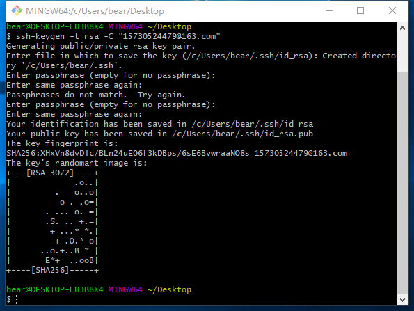
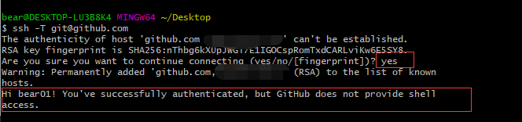
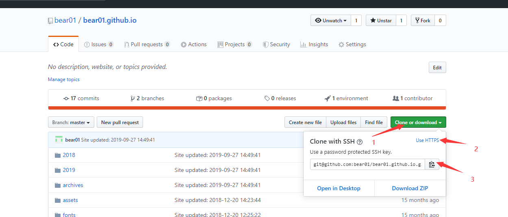
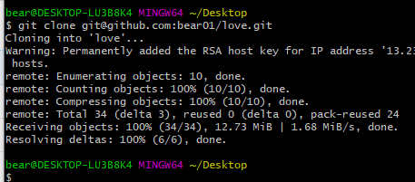

### 安装git ,连接Github,上传以及下载项目

#### git下载

官网下载[git](https://git-scm.com/downloads) 下载速度慢可以选择[第三方下载](https://pc.qq.com/detail/13/detail_22693.html),傻瓜式一键安装，安装选择默认即可。

#### 创建SSH Key

因为本地Git仓库和GitHub仓库之间的传输是通过SSH加密传输的，GitHub需要识别是否是你推送，GitHub只要知道了你的公钥，就可以确认只有你自己才能推送，所以需要配置ssh key。

1. **打开Git Bash，输入命令，创建SSH Key**

   ~~~
   $ ssh-keygen -t rsa -C "123456@126.com" //123456 是你自己注册GitHub的邮箱
   ~~~

   直接回车，密码可以不写。出现下图说明ssh创建成功了

​		再去用户主目录里找到`.ssh`文件夹，里面有`id_rsa`和`id_rsa.pub`两个文件，这两个就是SSH Key的秘钥对，`id_rsa`是私钥，不能泄露，`id_rsa.pub`是公钥，可以公开。

2. **github仓库添加ssh key**

   登录GitHub，打开“settings”--“SSH and GPG Keys”，然后点击“New SSH Key”，填上Title（随意写），在Key文本框里粘贴 `id_rsa.pub`文件里的全部内容。

3. **验证是否成功**

   ~~~
   $ ssh -T git@github.com //在git bash里输入该命令
   ~~~

   输入yes后出现以下内容说明连接成功

   

   4. **设置username和email**

   ​	github每次commit都会记录他们

   ~~~
   $ git config --global user.name  "name"//你的GitHub登陆名
   $ git config --global user.email "123456@126.com"//你的GitHub注册邮箱
   ~~~

   5. **git 下载**（git clone）

      打开GitHub仓库找到需要下载的项目，点击Clone or download 选择ssh,复制链接

   

   

   打开Git Bash ,输入git clone 粘贴链接，回车

   ~~~
   $ git clone git@github.com:bear01/bear01.github.io.git
   ~~~

   

   ​	出现以上内容说明下载成功，项目下载在当前路径下。

6. **git 上传**

**更新**：如果是更新仓库，直接在克隆的项目路径下打开git bash  ,输入下面四个命令

~~~
$git status //查看哪些文件被修改
$git add . // 添加需要修改的文件到缓存区，“.”代表添加所有修改
$git commit -m "提交注释" //将修改从暂存区提交到本地的版本库
$ git push origin master // 推送到github对应的分支上
~~~

**第一次上传**：

~~~
$ git remote add origin git@github.com:flora0103/example.git 
//关联一个远程库命令， git@github.com:flora0103/example.git   这个是自己远程库
$ git push -u origin master  
//关联后,第一次推送master分支的所有内容命令，此后，每次本地提交后，就可以使用命令git push origin master推送最新修改

~~~